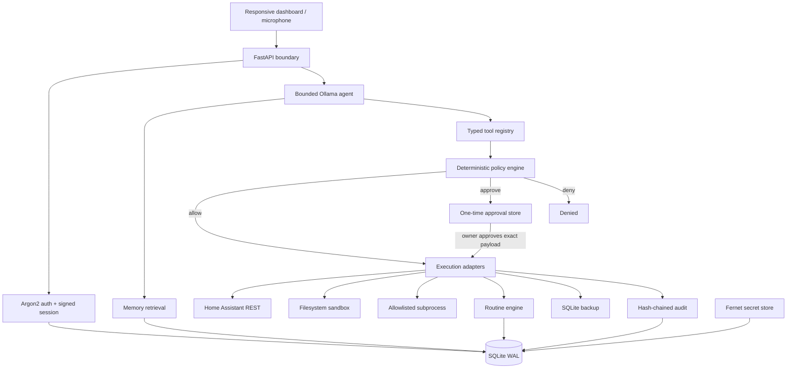

# Architecture

## Design objectives

1. Keep household data and inference local by default.
2. Prevent the LLM from directly owning credentials or execution authority.
3. Make every real-world change attributable, reviewable, and revocable.
4. Continue operating core deterministic features when the LLM is unavailable.
5. Keep integrations replaceable and the persistence model inspectable.

## Components

## Request flow

### Read-only question

1. The API authenticates the bearer session.
2. The agent loads bounded conversation history and relevant long-term memories.
3. Ollama may answer directly or propose a typed tool call.
4. The registry validates that the tool exists.
5. The policy engine allows the low-risk read.
6. The adapter executes it and returns structured output.
7. The model receives the result and produces the final response.
8. The invocation and outcome are appended to the audit chain.

### State-changing action

1. Ollama proposes a typed action.
2. The policy engine computes the effective risk from both the declared tool risk and arguments.
3. The exact payload is saved as a short-lived pending approval.
4. The owner sees tool name, arguments, reason, and risk.
5. Approval claims that exact database row atomically.
6. The registry executes the already-approved invocation with no opportunity for the model to mutate it.
7. Result and decision are audited.

## Persistence

SQLite uses WAL mode, foreign keys, busy timeouts, and explicit write transactions. Tables cover users, settings, encrypted secrets, conversations, messages, memories, routines, approvals, events, and audit records. FTS5 indexes memory content. Japanese text receives a substring fallback because SQLite's default tokenizer does not perform Japanese morphological segmentation.

## Failure behavior

- Ollama unavailable: chat enters an explicit degraded mode; deterministic pages remain usable.
- Home Assistant unavailable: commands fail closed and no success is claimed.
- Approval expired: atomic claim fails and the action does not run.
- Master-key mismatch: encrypted secrets fail to decrypt rather than returning garbage.
- Audit tampering: chain verification reports the first broken row.
- Process interruption during a backup: SQLite's backup API preserves a consistent snapshot.
- Process interruption during file write: a temporary file is atomically replaced only after complete write.

## Compatibility surfaces

- HTTP API models.
- Tool names and JSON schemas.
- Database records.
- Plugin `register(registry, services)` contract.
- Environment variables.

Breaking changes to these surfaces require a major version increment or an explicit migration.
